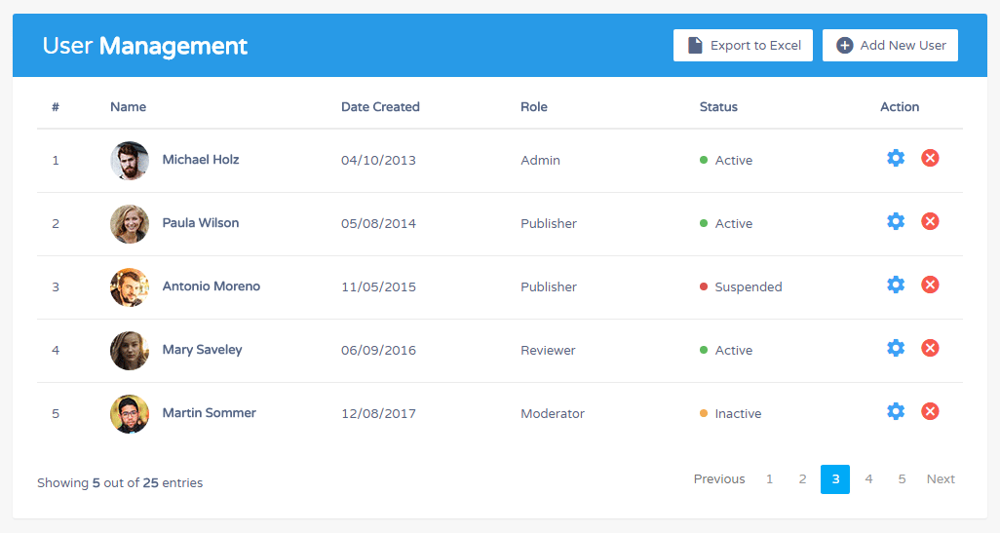

### Problem Statement

Wanted to create a realtime management solution to storing various information about users using the Steam api. A user would be able to view player stats, achievements, and in game data among other things.

### Main Features:
- Logging data
- Updating data
- viewing news

### Project Technologies/Techniques 

* Security/Authentication
  * AWS Cognito
* Database
  * MySQL 8.x
* ORM Framework
  * Hibernate Version TBD
* Dependency Management
  * Maven
* Web Services consumed using Java
  * TBD 
* CSS 
  * Bootstrap
* Data Validation
  * Bootstrap Validator for front end
  * Explore Hibernate Validator?
* Logging
  * Log4J2
* Hosting
  * AWS
* Tech I'd like to explore as part of this work
  * CI tools in AWS
  * Materialize
  * Hibernate Validator
  * Hibernate Search
* Project Lombok
* Unit Testing
  * JUnit tests to cover all testable logic
* IDE: IntelliJ IDEA

### Design

* [User Stories](DesignDocuments/userStories.md)
* [Screen Design](DesignDocuments/Screens.md)

### [Project Plan](ProjectPlan.md)

### Reflections and time spent
#### [TimeLog](TimeLog.md)

